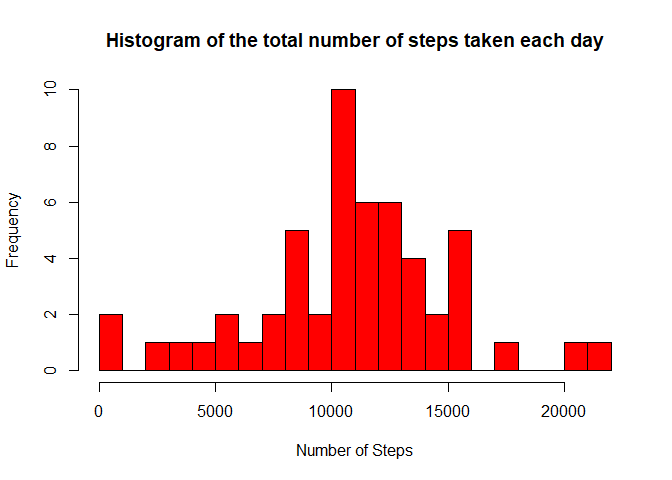
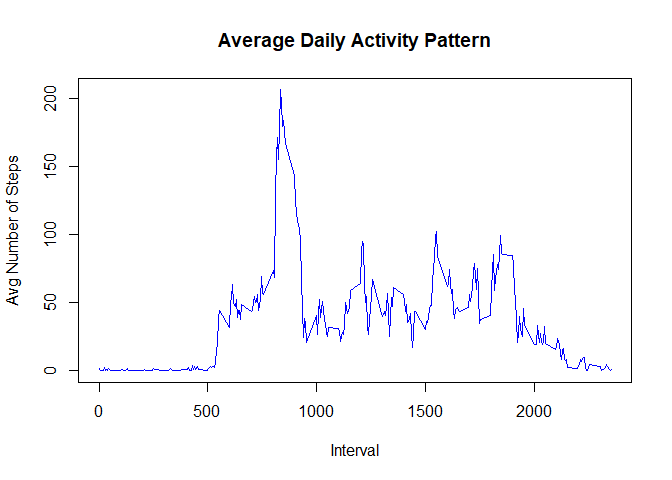
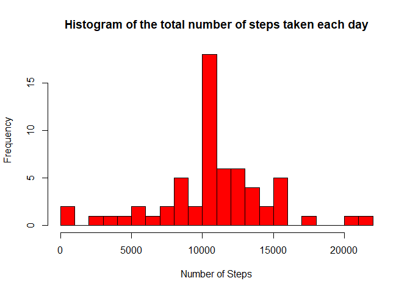
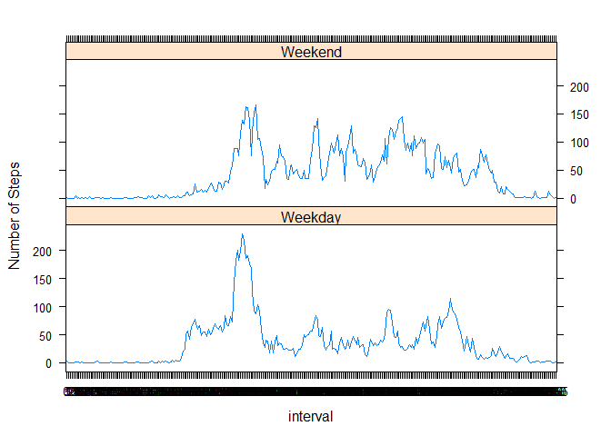

## 1 Loading and preprocessing the data


```r
### Set working dir  
setwd("~/R/Data_science_course/Git/RepData_PeerAssessment1")  

### Read provided data file  
data <- read.csv("activity.csv", header = TRUE, sep = ",", na.strings = "NA")  

### Look at the data  
head(data)
```

```
##   steps       date interval
## 1    NA 2012-10-01        0
## 2    NA 2012-10-01        5
## 3    NA 2012-10-01       10
## 4    NA 2012-10-01       15
## 5    NA 2012-10-01       20
## 6    NA 2012-10-01       25
```

```r
### Convert data to date resp. factor format  
data$date <- as.Date(data$date, format = "%Y-%m-%d")  
data$interval <- factor(data$interval)  

### Remove "na"  
data_clean <- data[!is.na(as.character(data$steps)),]  
head(data_clean)
```

```
##     steps       date interval
## 289     0 2012-10-02        0
## 290     0 2012-10-02        5
## 291     0 2012-10-02       10
## 292     0 2012-10-02       15
## 293     0 2012-10-02       20
## 294     0 2012-10-02       25
```

## 2 What is mean total number of steps taken per day?  

```r
### Creating a data frame with the steps taken for each day  
steps_aggr_day <- aggregate(steps ~ date, data = data_clean, sum)  

### Adding column names to the created data frame  
colnames(steps_aggr_day) <- c("date", "steps")  
hist(as.numeric(steps_aggr_day$steps), breaks = 20, col = "red", xlab = "Number of Steps", main= "Histogram of the total number of steps taken each day")  
```

<!-- -->

```r
### Mean
mean(steps_aggr_day$steps)  
```

```
## [1] 10766.19
```

```r
### Median  
median(steps_aggr_day$steps)
```

```
## [1] 10765
```

## 3 What is the average daily activity pattern?  

```r
### Calculating the average  
avg_steps_aggr <- aggregate(data_clean$steps, by=list(interval=data_clean$interval), FUN=mean)  

### Adding columns names  
colnames(avg_steps_aggr) <- c("interval", "average_steps")  

### ploting the average daily activity pattern  
plot(as.integer(levels(avg_steps_aggr$interval)), avg_steps_aggr$average_steps, type="l", xlab = "Interval", ylab = "Avg Number of Steps", main = "Average Daily Activity Pattern",  col ="blue")
```

<!-- -->

```r
### The maximum number of average steps
max_steps <- max(avg_steps_aggr$average_steps)  
max_steps  
```

```
## [1] 206.1698
```

```r
### The 5-minute interval that contains the maximum number of steps  
interval_max_steps <- avg_steps_aggr[which.max(avg_steps_aggr$average_steps),]$interval  
interval_max_steps  
```

```
## [1] 835
## 288 Levels: 0 5 10 15 20 25 30 35 40 45 50 55 100 105 110 115 120 125 ... 2355
```

## 4 Imputing missing values

```r
### find missing values steps  
sum(is.na(as.character(data$steps)))  
```

```
## [1] 2304
```

```r
### find missing values date  
sum(is.na(as.character(data$date)))  
```

```
## [1] 0
```

```r
#### find missing values inteval  
sum(is.na(as.character(data$interval)))  
```

```
## [1] 0
```

```r
### finding the indices of missing values (NAs)  
missing_values_index <- which(is.na(as.character(data$steps)))  
all_data <- data  

### Imputing missing values using the mean for that 5-minute interval  
all_data[missing_values_index,   ]$steps<-unlist(lapply(missing_values_index,FUN=function(missing_values_index){  
avg_steps_aggr[data[missing_values_index,]$interval==avg_steps_aggr$interval,]$average_steps  
}))  

### Look at the data

summary(all_data)  
```

```
##      steps             date               interval    
##  Min.   :  0.00   Min.   :2012-10-01   0      :   61  
##  1st Qu.:  0.00   1st Qu.:2012-10-16   5      :   61  
##  Median :  0.00   Median :2012-10-31   10     :   61  
##  Mean   : 37.38   Mean   :2012-10-31   15     :   61  
##  3rd Qu.: 27.00   3rd Qu.:2012-11-15   20     :   61  
##  Max.   :806.00   Max.   :2012-11-30   25     :   61  
##                                        (Other):17202
```

```r
steps_each_day_full <- aggregate(steps ~ date, data = all_data, sum)  

### Adding column names to the created data frame  
colnames(steps_each_day_full) <- c("date", "steps")

#### Making the histogram  
hist(as.numeric(steps_each_day_full$steps), breaks = 20, col = "red", xlab = "Number of Steps", main= "Histogram of the total number of steps taken each day")  
```

<!-- -->

```r
### Mean  
mean(steps_each_day_full$steps)  
```

```
## [1] 10766.19
```

```r
### Median  
median(steps_each_day_full$steps)    
```

```
## [1] 10766.19
```
## 5 Are there differences in activity patterns between weekdays and weekends?

```r
### Creating a factor variable "day" to store the day of the week  
all_data$day <- as.factor(weekdays(all_data$date))  

### Creating a logical variable "is_weekday" (weekday=TRUE, weekend = FALE) :  
all_data$is_weekday <- ifelse(!(all_data$day %in% c("lördag","söndag")), TRUE, FALSE)  

### Calculating the average number of steps for weekdays  
weekdays_data <- all_data[all_data$is_weekday,]  
steps_per_interval_weekdays <- aggregate(weekdays_data$steps,by=list(interval=weekdays_data$interval), FUN=mean)  

### Calculating the average number of steps for weekends  
weekends_data <- all_data[!all_data$is_weekday,]  
steps_per_interval_weekends <- aggregate(weekends_data$steps, by=list(interval=weekends_data$interval),   FUN=mean)  

###  Adding columns names  
colnames(steps_per_interval_weekdays) <- c("interval", "average_steps")  
colnames(steps_per_interval_weekends) <- c("interval", "average_steps")  

####  Adding a column to indecate the day  
steps_per_interval_weekdays$day <- "Weekday"  
steps_per_interval_weekends$day <- "Weekend"    

### Merging the two datasets  
week_data <- rbind(steps_per_interval_weekends, steps_per_interval_weekdays)  

### Convert day to factor type  
week_data$day <- as.factor(week_data$day)  

### Making the plot  
library(lattice)  
xyplot(average_steps ~  interval | day, data = week_data, layout = c(1,2), type ="l", ylab="Number of Steps")  
```

<!-- -->


```r
#END OF PROJECT
```


